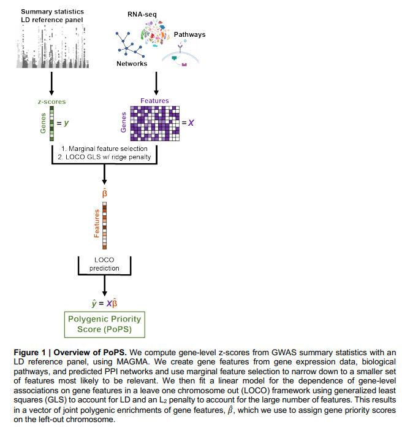

</img>

## Polygeneic Priority Score - Pytorch

This repository will reproduce the results of <a href="https://www.medrxiv.org/content/10.1101/2020.09.08.20190561v1">this paper</a> in Pytorch. The official repository can be found <a href="https://github.com/FinucaneLab/pops">here</a>.

## Citations

```bibtex
@article {Weeks2020.09.08.20190561,
	author = {Weeks, Elle M and Ulirsch, Jacob C and Cheng, Nathan Y and Trippe, Brian L and Fine, Rebecca S and Miao, Jenkai and Patwardhan, Tejal A and Kanai, Masahiro and Nasser, Joseph and Fulco, Charles P and Tashman, Katherine C and Aguet, Francois and Li, Taibo and Ordovas-Montanes, Jose and Smillie, Christopher S and Biton, Moshe and Shalek, Alex K and Ananthakrishnan, Ashwin N and Xavier, Ramnik J and Regev, Aviv and Gupta, Rajat M and Lage, Kasper and Ardlie, Kristin G and Hirschhorn, Joel N and Lander, Eric S and Engreitz, Jesse M and Finucane, Hilary K},
	title = {Leveraging polygenic enrichments of gene features to predict genes underlying complex traits and diseases},
	year = {2020},
	publisher = {Cold Spring Harbor Laboratory Press},
	URL = {https://www.medrxiv.org/content/early/2020/09/10/2020.09.08.20190561},
	eprint = {https://www.medrxiv.org/content/early/2020/09/10/2020.09.08.20190561.full.pdf},
	journal = {medRxiv}
}
```
